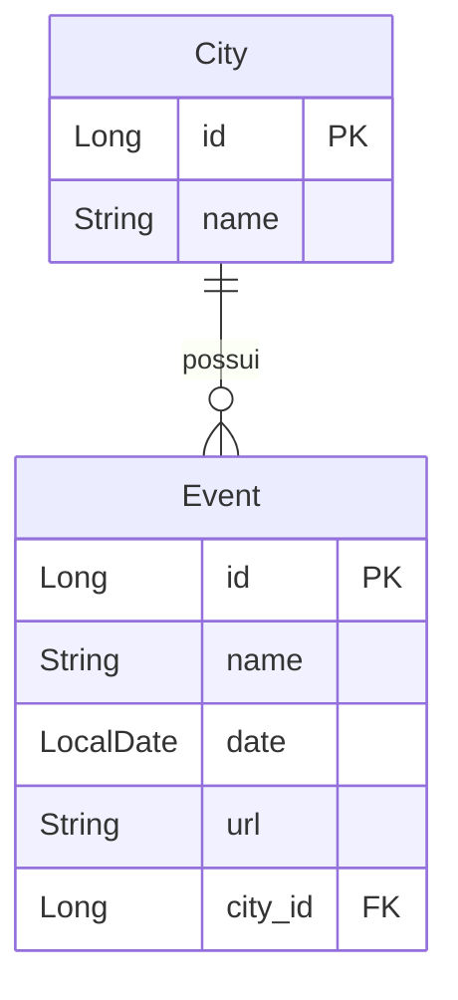

# Desafio DevSuperior - TDD: Event City

[](https://openjdk.org/projects/jdk/17/)
[](https://spring.io/projects/spring-boot)
[](https://hibernate.org/)
[](https://www.h2database.com/)
[](https://junit.org/junit5/)
[](https://site.mockito.org/)
[](https://github.com/Jacques-Trevia/desafio-tdd-event-city/blob/main/LICENSE)

## 📖 Sobre o Projeto

Este repositório contém a resolução de um **desafio prático** do curso **Java Spring Professional** da DevSuperior, com um diferencial fundamental: o uso de **TDD (Test-Driven Development)** para o desenvolvimento da API.

O objetivo é construir uma API REST para gerenciamento de **Eventos** e **Cidades**, consolidando conceitos como:

- **TDD**: Desenvolvimento guiado por testes (escrever o teste falho → implementar → refatorar)
- **Testes de integração** com Spring Boot e JUnit 5
- **Testes de camada web** com `MockMvc` e `@WebMvcTest`
- **Testes de repositório** com `@DataJpaTest`
- **Validação de dados** com Bean Validation
- **Tratamento de exceções** e respostas padronizadas

## 🎯 Objetivo do Desafio

Aprender na prática como:
- Aplicar a metodologia **TDD** no desenvolvimento de uma API REST
- Escrever **testes de integração** antes da implementação
- Testar **controllers** (camada web) com `MockMvc`
- Testar **repositórios** (camada de dados) com `@DataJpaTest`
- Garantir a qualidade do código através de uma **suíte de testes completa**

## ✨ Funcionalidades

### Gestão de Cidades
- **CRUD completo** de cidades (Create, Read, Update, Delete)
- Validação: nome da cidade não pode ser vazio

### Gestão de Eventos
- **CRUD completo** de eventos (com data, nome, URL do ingresso, cidade associada)
- Validações:
  - Nome do evento não pode ser vazio
  - Data do evento não pode ser passada (deve ser futura)
  - URL do ingresso deve ser válida (formato de URL)
  - Evento deve estar associado a uma cidade existente

## 🚀 Tecnologias Utilizadas

- **Java 17**: Linguagem de programação.
- **Spring Boot 2.7.x**: Framework principal.
- **Spring Data JPA**: Abstração para acesso a dados.
- **Hibernate**: Implementação do JPA.
- **H2 Database**: Banco de dados em memória para testes.
- **JUnit 5**: Framework de testes.
- **Mockito**: Mocking para testes isolados.
- **AssertJ**: Biblioteca para assertions fluentes.
- **Postman**: Teste manual da API (coleção incluída).
- **Maven**: Gerenciador de dependências.

## 📁 Estrutura do Projeto
```
src/
├── main/
│ ├── java/com/jacques/desafiotddeventcity/
│ │ ├── DesafioTddEventCityApplication.java # Classe principal
│ │ ├── controllers/ # Camada de controle
│ │ │ ├── CityController.java
│ │ │ └── EventController.java
│ │ ├── dto/ # Objetos de transferência
│ │ │ ├── CityDTO.java
│ │ │ └── EventDTO.java
│ │ ├── entities/ # Entidades JPA
│ │ │ ├── City.java
│ │ │ └── Event.java
│ │ ├── repositories/ # Camada de acesso a dados
│ │ │ ├── CityRepository.java
│ │ │ └── EventRepository.java
│ │ ├── services/ # Camada de negócio
│ │ │ ├── CityService.java
│ │ │ ├── EventService.java
│ │ │ └── exceptions/ # Tratamento de exceções
│ │ │ ├── ResourceNotFoundException.java
│ │ │ ├── DatabaseException.java
│ │ │ └── ResourceExceptionHandler.java
│ │ └── config/ # Configurações
│ └── resources/
│ └── application.properties # Configuração do H2 e JPA
└── test/ # Testes (core do desafio!)
└── java/com/jacques/desafiotddeventcity/
├── controllers/ # Testes de controller (MockMvc)
│ ├── CityControllerIT.java
│ └── EventControllerIT.java
├── repositories/ # Testes de repositório
│ ├── CityRepositoryIT.java
│ └── EventRepositoryIT.java
└── services/ # Testes de serviço
├── CityServiceIT.java
└── EventServiceIT.java
```

## 🗺️ Modelo de Domínio


Relacionamentos:

City → Event: OneToMany (uma cidade pode ter vários eventos)

Event → City: ManyToOne (cada evento pertence a uma cidade)

## ▶️ Como Executar o Projeto
Pré-requisitos
JDK 17 ou superior

Maven (ou utilizar o wrapper ./mvnw)

Passos
Clone o repositório:

bash
```
git clone https://github.com/Jacques-Trevia/desafio-tdd-event-city.git
cd desafio-tdd-event-city
```
Execute os testes (TDD):

bash
```
./mvnw test
```
Todos os testes devem passar (verde).

Execute a aplicação:

bash
```
./mvnw spring-boot:run
```
A API estará disponível em http://localhost:8080.

## 🧪 Testes Implementados (TDD)
1. Testes de Integração - Controllers (@SpringBootTest)
CityControllerIT:
```
insertCity_ShouldReturnCreated_WhenValidData

insertCity_ShouldReturnBadRequest_WhenNameIsBlank

findAllCities_ShouldReturnListOfCities

updateCity_ShouldReturnOk_WhenCityExists

updateCity_ShouldReturnNotFound_WhenCityDoesNotExist

deleteCity_ShouldReturnNoContent_WhenCityExists

deleteCity_ShouldReturnNotFound_WhenCityDoesNotExist
```
EventControllerIT:
```
insertEvent_ShouldReturnCreated_WhenValidData

insertEvent_ShouldReturnBadRequest_WhenNameIsBlank

insertEvent_ShouldReturnBadRequest_WhenDateIsPast

insertEvent_ShouldReturnBadRequest_WhenUrlIsInvalid

insertEvent_ShouldReturnNotFound_WhenCityDoesNotExist

findEventsByCity_ShouldReturnListOfEvents

updateEvent_ShouldReturnOk_WhenEventExists

deleteEvent_ShouldReturnNoContent_WhenEventExists
```
2. Testes de Repositório (@DataJpaTest)
```
saveCity_ShouldPersistData

findCityByName_ShouldReturnCity_WhenNameExists

existsEventByCityId_ShouldReturnTrue_WhenCityHasEvents
```

3. Testes de Serviço (@ExtendWith(MockitoExtension.class))
```
findAll_ShouldReturnListOfCities

insert_ShouldSaveAndReturnCityDTO

insert_ShouldThrowException_WhenNameIsBlank

delete_ShouldThrowException_WhenCityHasEvents
```

## 🔌 Endpoints da API
Método	Endpoint	Descrição	Validações
```
GET	/cities	Listar todas as cidades	
GET	/cities/{id}	Buscar cidade por ID	
POST	/cities	Inserir nova cidade	name: @NotBlank
PUT	/cities/{id}	Atualizar cidade	name: @NotBlank
DELETE	/cities/{id}	Deletar cidade	Verificar se não há eventos associados
GET	/events	Listar todos os eventos	
GET	/events/{id}	Buscar evento por ID	
GET	/events/city/{cityId}	Listar eventos por cidade	-
POST	/events	Inserir novo evento	name: @NotBlank; date: @FutureOrPresent; url: @URL; cityId: @NotNull
PUT	/events/{id}	Atualizar evento	Mesmas validações do POST
DELETE	/events/{id}	Deletar evento	
```

## 📦 Exemplos de Requisições (Postman)
Uma coleção do Postman está incluída no repositório: Desafio TDD Event City.postman_collection.json

POST /cities - Criar cidade:
```
json
{
    "name": "São Paulo"
}
```
POST /events - Criar evento:
```
json
{
    "name": "Spring Boot Workshop",
    "date": "2025-12-15",
    "url": "https://evento.com/spring-boot",
    "cityId": 1
}
```
Resposta de erro (422) - Data passada:
```
json
{
    "timestamp": "2025-05-14T10:00:00Z",
    "status": 422,
    "error": "Unprocessable Entity",
    "message": "Validation error",
    "path": "/events",
    "errors": [
        {"field": "date", "message": "A data do evento deve ser futura ou presente"}
    ]
}
```

## 📚 Aprendizados com TDD
Este desafio permitiu praticar:

✅ Red-Green-Refactor: Ciclo clássico do TDD

✅ Testes de integração com @SpringBootTest e TestRestTemplate

✅ Testes de camada web com MockMvc e @WebMvcTest

✅ Testes de repositório com @DataJpaTest

✅ Testes de serviço com mocks (@MockBean, Mockito)

✅ Assertions fluentes com AssertJ

✅ Cobertura de cenários: sucesso, erro de validação, erro de negócio

✅ Tratamento de exceções testado

## 🎯 Por que TDD?
O TDD (Test-Driven Development) garante que:

O código é testável por natureza

Os requisitos são claramente definidos antes da implementação

Refatorações seguras (testes quebram se algo falhar)

Documentação viva do comportamento esperado

Menor número de bugs em produção

## 📜 Licença

Este projeto é parte do curso da **DevSuperior** e tem propósito educacional.

---

## 👨‍💻 Autor

**Jacques Araujo Trevia Filho**

[](https://www.linkedin.com/in/jacques-trevia)
[](https://github.com/Jacques-Trevia)
